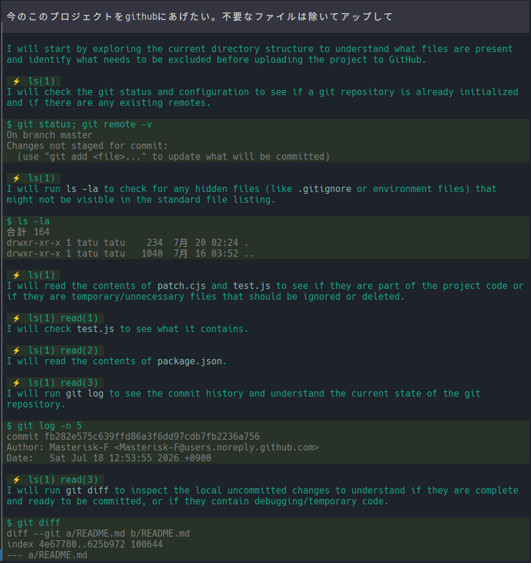

# pi-tools-compact-display

An extension for the Pi Assistant that allows you to finely customize the terminal (TUI) output for various tools (e.g., bash, read, ls, edit) on a per-tool basis.

It helps keep your context and screen clean by limiting overly long tool outputs or hiding unnecessary tool calls, summarizing them instead.



## Features

- **Per-Tool Configuration**: Set different display modes for each tool.
- **Summary Display**: Hide execution details and output only a summary like `⚡ read(1) ls(2)` at the top of the assistant's response.
- **Line Limit & Padding Removal**: Limit the number of output lines and automatically strip empty padding lines.
- **Support for External Tools**: Override the display settings not only for Pi's built-in tools but also for any custom tools added by other extensions.
- **Expandable Details**: Fully supports Pi's native expand feature (e.g., pressing `Ctrl+O` in the TUI), overriding the limits to show the full output.

---

## Installation & Build

```bash
# Clone or navigate to the repository
cd pi-tools-compact-display

# Install dependencies
npm install

# Build the TypeScript code
npm run build

# Install the extension using the Pi CLI
pi install .
```

---

## Configuration

Create a configuration file named `config.json` at the following location:

**File Path:**
`~/.pi/agent/extensions/pi-tools-compact-display/config.json`

### Configuration Structure

The configuration is in JSON format, where the key is the "tool name" and the value is its "display settings (options)".

```json
{
  "tool_name": {
    "mode": "display_mode",
    "outputLines": number,
    "noPadding": true or false
  }
}
```

### Available Properties

| Property | Type | Description |
| --- | --- | --- |
| **`mode`** | `string` | The display mode for the tool. Must be `"count_only"`, `"lines"`, or `"default"`. (Required) |
| **`outputLines`** | `number` | The maximum number of lines to display. Only effective when `mode` is `"lines"`. (Optional) |
| **`noPadding`** | `boolean` | Whether to remove leading, trailing, and consecutive empty lines from the output. Set to `true` to omit empty lines. Only effective when `mode` is `"lines"`. (Optional) |

### Display Modes (`mode`)

1. **`"count_only"`**
   - **Behavior**: The tool execution and its output are completely hidden from the screen. Instead, the number of executions is summarized at the top of the assistant's message (e.g., `⚡ read(1)`).
   - **Use Case**: Best for tools like `read`, `ls`, `find`, or `grep`, where the LLM gathers information autonomously and humans do not need to read the raw output.

2. **`"lines"`**
   - **Behavior**: Displays the tool execution command and a truncated portion of its result. It limits the output to the specified `outputLines`.
   - **Use Case**: Ideal for tools like `bash`, `edit`, or `write`, where humans want to quickly check the executed command and whether it resulted in an error.

3. **`"default"`**
   - **Behavior**: Bypasses this extension's rendering overrides and falls back to Pi's default rendering logic (or logic defined by other extensions).
   - **Note**: Any tool not specified in the configuration file, or if `config.json` is missing entirely, will automatically default to `default`.

---

### Example Configuration

```json
{
  "read": { "mode": "count_only" },
  "ls": { "mode": "count_only" },
  "find": { "mode": "count_only" },
  "grep": { "mode": "count_only" },
  
  "bash": { 
    "mode": "lines", 
    "outputLines": 3, 
    "noPadding": true 
  },
  "write": { 
    "mode": "lines", 
    "outputLines": 1, 
    "noPadding": true 
  },
  
  "mcp:tavily_tavily_search": { "mode": "count_only" },
  "mcp:list": { "mode": "lines", "outputLines": 10 },
  "mcp": { "mode": "default" },
  "default": { "mode": "count_only" },

  "my_custom_tool": {
    "mode": "count_only"
  }
}
```

*Note: You can specify any tool name, including custom tools added by other extensions like `my_custom_tool`.*

### Sub-tool and Action-Specific Configuration (Gateway Tools like MCP)

For "gateway tools" that call other tools or actions internally (such as the `mcp` tool), you can configure them specifically based on their arguments (like `tool` or `action`).

The configuration priority is evaluated in a cascading fallback:
**Specific Sub-tool Configuration > General Tool Configuration > `default` Key Configuration > System Default**.
This mechanism applies to all tools, not just MCP.

**Example for MCP tools:**
- **`mcp:<tool_name>`**: When a specific MCP tool is called (e.g., `"mcp:tavily_tavily_search": { "mode": "count_only" }`).
- **`mcp:list`**: When listing available tools on a server (e.g., `"mcp:list": { "mode": "lines", "outputLines": 10 }`).
- **`mcp:connect`**: When connecting to a server.
- **`mcp`**: The general fallback for MCP calls that don't match any specific configuration.

*Note: The same priority (`specific setting > "default" setting`) applies to built-in tools like `read` and `bash` as well.*

---

## Usage & Shortcuts

After setting up the configuration, simply start the Pi assistant.

- **Context Cleanup**: Tools set to `count_only` will display summaries like `⚡ read(1)` on the screen. However, this summary text is automatically stripped from the conversation history (context) sent to the LLM behind the scenes, so it won't pollute the LLM's context window.
- **Full Output (Expanded)**: If the output is truncated in `lines` mode, you can use Pi's native expand shortcut (typically `Ctrl+O`) to bypass the line limits and view the full output.
